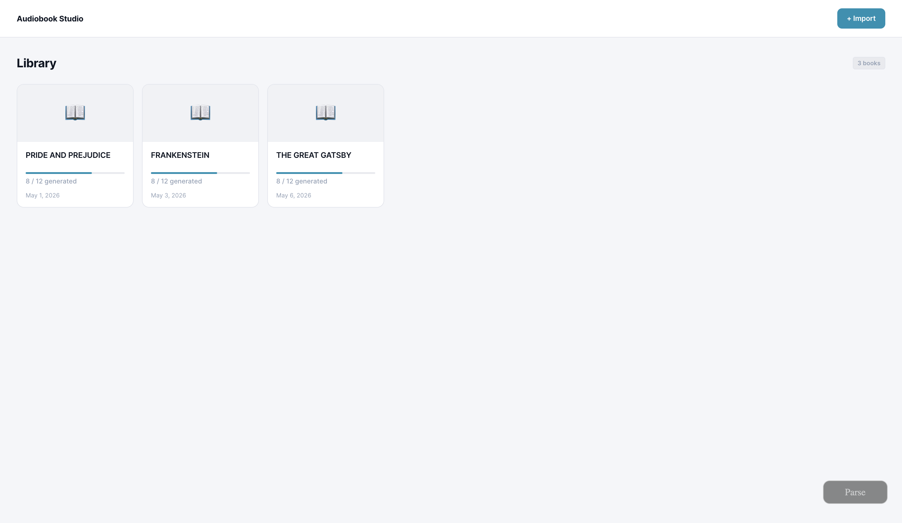
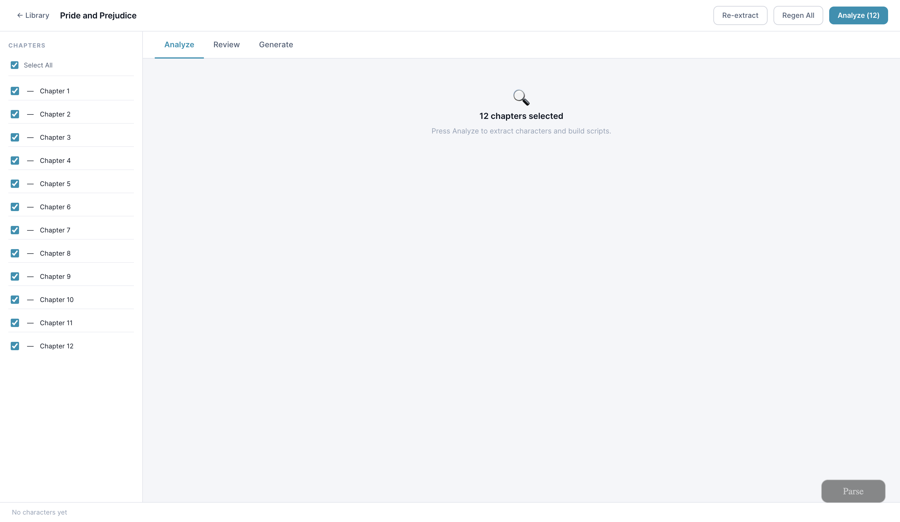
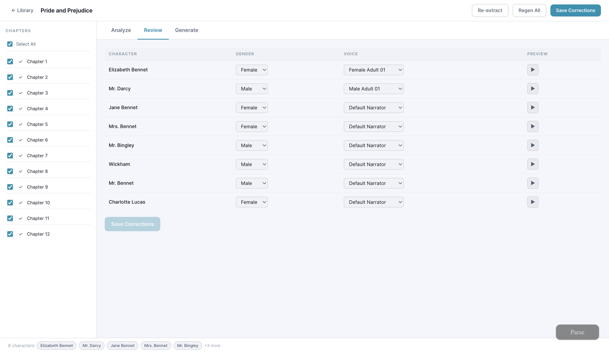
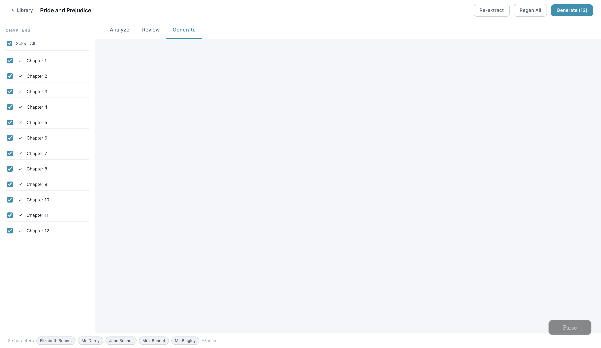

# Voiceover

Voiceover 是一个运行在局域网内的网页应用，可以将 EPUB、PDF 和 TXT
书籍转换为按章节组织的有声书，并支持角色感知的对话分析和配音分配。

本应用采用“主机中心”模式：主机负责运行网页服务、SQLite 数据库、上传的
书籍、Python 处理程序、模型调用和音频生成。其他用户只需要在同一个可信的
局域网内使用浏览器访问即可。当前没有登录系统，也没有按用户隔离书库。

## 项目来源与二次开发

本项目基于 [Audiobook Generator](https://github.com/yassinebk/audiobook-generator)
进行二次开发，并发布为 Voiceover。这是一个独立的新仓库，不是原仓库的官方
发布版本。

在保留原有桌面版/Tauri 和本地 Python 处理能力的基础上，本项目主要增加和调整了：

- 局域网网页模式，支持其他设备直接通过浏览器访问
- 主机集中管理 SQLite 数据库、书籍文件、章节脚本和生成音频
- EPUB、PDF、TXT 导入、正文预览以及按章节顺序展示
- 按书籍维护的角色注册表和跨章节角色上下文传递
- 浏览器端的章节分析、审阅、音频生成和持续播放流程

原项目的 MIT 许可证和版权声明已保留，具体见 [LICENSE](LICENSE)。

## 各部分运行位置

| 组件 | 运行位置 | 负责内容 |
| --- | --- | --- |
| React 前端 | 浏览器 | 导入、分析、审阅、生成和播放界面 |
| Python 网页服务 | 主机 | HTTP API、文件上传、共享 SQLite 数据库和静态文件 |
| Python 处理程序 | 主机 | EPUB/PDF/TXT 提取、OCR、章节分析、TTS 和音频合成 |
| SQLite 和书籍文件 | 主机 | 共享书库、脚本、上传文件和生成的音频 |

只有主机需要访问书籍文件、数据库、Python 环境、模型配置和 TTS 凭据。
局域网用户通过浏览器上传或操作，数据会由主机统一保存和处理。

## 功能

- 导入 EPUB、PDF 和 TXT 书籍，扫描版 PDF 支持 OCR 回退
- 分析前预览提取出的章节正文
- 按章节分析旁白、对话、说话人、情绪和语速
- 维护整本书范围内的角色注册表，并使用系统生成的稳定角色 ID
- 审阅角色身份、别名和声音分配
- 在“模型配置”页签选择分析 LLM 和配音模型，并持久化主机设置
- 在浏览器中生成和播放章节音频
- 无需账号即可让可信局域网用户共同使用同一个书库

## 界面截图









## 架构

```text
浏览器用户
      │ HTTP
      ▼
Python 局域网网页服务 :8000
      ├── React 生产文件
      ├── SQLite 数据库
      ├── uploads/ 和 books/<book-id>/ 工作目录
      └── Python 处理程序
            ├── EPUB/PDF/TXT 提取和 OCR
            ├── LLM 角色与对话分析
            ├── TTS 语音合成
            └── 章节音频合成
```

仓库中仍保留桌面版/Tauri 文件，用于兼容原有的桌面工作流。当前推荐的
局域网共享方式是 Python 网页服务加 React 前端。

## 端口和运行模式

网页应用有两种常用运行模式：

- `8000` 是 Python 网页服务端口。生产模式下，它还会直接提供构建后的
  React 前端。局域网其他设备访问：`http://<主机局域网 IP>:8000`。
- `5173` 是 Vite 开发前端端口，会把 `/api` 请求代理到主机的 `8000` 端口。
  开发时访问：`http://<主机局域网 IP>:5173`。

### 环境要求

- Node.js 20 或更高版本
- Python 3.12 或更高版本
- Python 依赖管理工具 `uv`
- 当前主要支持 macOS；如果已正确安装依赖，也可以使用 CPU 或其他受支持的
  PyTorch 设备

### 安装依赖

```bash
npm install
cd workers/python
uv sync
cd ../..
```

### Whisper 转录依赖（背景音/音效分析所需）

点击“分析背景音/音效”后，程序会在原章节配音完成的基础上使用本地 Whisper 生成带时间戳的转录，再由音频规划 LLM 安排背景音乐和音效。没有 Whisper 不影响书籍导入、章节分析和原章节配音，但不能执行这一阶段。

项目的 Python 依赖已声明 `mlx-whisper`；Apple Silicon 主机按上面的 `uv sync` 安装即可。默认模型是 `mlx-community/whisper-large-v3-turbo`。如果主机已经在其它 Python 环境安装了 `mlx-whisper`，程序会自动尝试复用；也可以显式指定解释器：

```bash
export AUDIOBOOK_WHISPER_PYTHON="$HOME/.hermes/hermes-agent/venv/bin/python"
```

模型如果已在 Hugging Face 本地缓存，程序会直接使用本地快照；没有缓存时，首次转录需要下载模型。Worker 请求也可以用 `whisperModel` 和 `whisperPython` 覆盖默认值。

### 生产模式：局域网使用

```bash
npm run web
```

该命令会先构建 React 前端，然后在 `0.0.0.0:8000` 启动 Python 网页服务。
启动后，可从任意可信的局域网设备访问终端中显示的主机地址。

### 开发模式

```bash
npm run web:dev
```

该命令会同时启动 Python API（`8000`）和 Vite 前端（`5173`）。如果修改了
Python 代码或提示词，可以在终端按 `Control-C` 停止服务，再重新运行该命令。

在 macOS 上，也可以创建一个可选的桌面快捷方式：

```bash
ln -s "$(git rev-parse --show-toplevel)/scripts/Audiobook-Generator.command" "$HOME/Desktop/Voiceover.command"
```

## 数据存储和隐私

默认情况下，网页服务会把共享数据保存在仓库之外：

- macOS：`~/Library/Application Support/audiobook-generator/`
- Windows：`%APPDATA%/audiobook-generator/`
- Linux：`$XDG_CONFIG_HOME/audiobook-generator/`，或 `~/.config/audiobook-generator/`

该目录包含 `audiobook.db`、上传的源文件、提取后的章节、分析脚本和生成的
音频。可以通过 `AUDIOBOOK_DATA_DIR` 指定其他主机目录。

当前局域网服务没有认证、授权和按用户隔离功能，只应暴露在可信的私有网络中。
任何能够访问网页的用户都可以查看共享书库并启动处理任务。

正文提取、数据库存储和本地处理都在主机上完成。但应用也可以配置为调用外部服务：

- 如果 OpenAI 兼容 LLM 的 `baseUrl` 指向远程服务，章节正文和分析提示词可能会
  发送到该服务
- 网页生成流程的配音模型由“模型配置”页签选择：默认是 Xiaomi MiMo V2.5
  voice-clone，也可以选择已检测可用的本地 VoxCPM2。MiMo 首次为角色或旁白建立
  稳定参考音色时会使用 voice-design 模型，后续片段复用该参考样本；VoxCPM2 使用
  独立的本地参考 WAV 和缓存目录
- Python 处理程序仍保留 Kokoro 和 Parler 后端，用于本地或其他工作流；网页可选项
  当前只开放 MiMo voice-clone 和 VoxCPM2

只有在 LLM 和 TTS 后端都配置为本地运行时，才可以称为“完全离线部署”。

## 模型配置和密钥

网页的“模型配置”页签可以直接配置 OpenAI 兼容的 LLM 模型 ID、服务 URL 和 API Key。
保存后会将下列值写入项目根目录的 `.env`（Git 已忽略该文件，写入权限会收紧为仅当前用户可读写）：

```env
AUDIOBOOK_LLM_MODEL=provider/model-id
AUDIOBOOK_LLM_BASE_URL=https://api.example.com/v1
AUDIOBOOK_LLM_API_KEY=
```

可从 [`.env.example`](.env.example) 复制该模板。API Key 是仅写字段：读取网页配置时只会返回“是否已配置”，不会返回完整值、掩码值，也不会写入 SQLite 或批量任务快照。将输入框留空会保留原有密钥；需要移除时，请勾选“清除已保存的 API Key”。

项目 `.env` 中的 URL 和 Key 会优先于旧配置生效。每次保存会立刻更新网页服务进程环境，之后启动的分析/音频规划 worker 会使用新配置；服务重启后也会从项目 `.env` 重新读取。

为兼容现有安装，未配置项目 `.env` 时，处理程序仍会从主机用户目录读取模型目录与旧提供方配置：

- `~/.pi/agent/models.json`
- `~/.pi/models.json`

这两个文件现在仅作为模型目录、模型元数据和旧安装回退来源；新的 URL/Key 应通过网页或项目 `.env` 保存，而非继续写入用户级 `models.json`。如果找不到可用的模型配置，处理程序会使用确定性的 mock 分析器，便于测试流水线。

为兼容不同的 OpenAI 兼容网关，分析请求默认不发送 `response_format`，而是由提示词和本地 JSON 解析器约束结构化输出。只有确认某个网关支持 JSON mode 时，才在提供方或模型条目中设置
`"supportsResponseFormat": true`。

不要把 API Key 写入仓库。`.env`、`.env.*` 和常见凭据文件已经被 Git 忽略；不要手工将 `.env` 添加到提交中。旧的 `models.json` 结构仍可供历史安装回退：

```json
{
  "default": "deepseek/deepseek-v4-flash",
  "providers": {
    "deepseek": {
      "baseUrl": "https://api.deepseek.com/v1",
      "api": "openai-completions",
      "apiKeyEnv": "DEEPSEEK_API_KEY",
      "models": [
        { "id": "deepseek/deepseek-v4-flash", "maxTokens": 384000 }
      ]
    }
  }
}
```

当前 MiMo TTS 流程从主机环境变量 `MIMO_API_KEY` 或 macOS 钥匙串服务
`audiobook-generator.mimo-api-key` 中读取密钥。不要把密钥放入源代码、README、
提交到 Git 的模型配置、截图或日志中。

仓库中只应出现环境变量名称和 `test-key` 之类的测试占位值，不能包含真实凭据。

### 网页模型配置

打开书籍详情页，在“下载”旁进入“模型配置”页签即可选择：

- 分析 LLM：来自主机现有的 OpenAI 兼容模型配置。浏览器只收到模型的安全显示元数据，
  不会收到 API Key、完整密钥、provider URL 或密钥环境变量名
- 配音模型：MiMo voice-clone，或本机已通过环境、包导入和模型文件检查的 VoxCPM2

设置保存到主机 SQLite。创建批量任务时会冻结 LLM/TTS 配置快照，因此任务运行期间
修改全局设置不会让同一批次中途切换模型。切换配音模型后，片段、时间线和参考音色
缓存按后端和模型隔离，不会混用旧模型产物。

VoxCPM2 不是仓库依赖自动下载的服务。主机必须提供 `data/voxcpm2/.venv` 和
`data/voxcpm2/models/VoxCPM2`；这些模型权重和虚拟环境被 Git 忽略，不应提交到仓库。
默认最多允许四个 VoxCPM2 章节客户端同时提交工作，但它们共用一个按需启动的常驻
本地模型服务，而不是每章各加载一份模型。服务会在角色参考音色就绪后，跨章节挑选
长度相近的独立片段做真实张量 batch；每个章节仍按原始片段顺序写入缓存、组装时间线
和最终音频。批量与直接 TTS 请求共用这四个客户端资源位。

服务只在首个本地 VoxCPM2 请求到来时启动，默认空闲 300 秒后释放模型。为了避免在
MPS 统一内存上盲目放大 batch，`AUDIOBOOK_VOXCPM_BATCH_SIZE=auto` 在没有匹配版本的
本机基准选择文件时始终使用 `1`；只有 B=2 或 B=4 同时通过 WAV、时间线、混音和内存
校验，并且吞吐至少比 B=1 提高 3% 后，`auto` 才会采用该值。需要排障时可显式设为 `1`
恢复为单条推理。

VoxCPM2 的固定音色与片段演绎提示词、语言选择和缓存版本详见
[VoxCPM2 Prompting Contract](docs/design/voxcpm2-prompting.md)。

## TTS 设备配置

Kokoro 和 Parler 使用 `AUDIOBOOK_TTS_DEVICE`：

```bash
export AUDIOBOOK_TTS_DEVICE="auto"  # auto、mps、cuda 或 cpu
```

选择 MiMo 时，网页生成音频需要配置 `MIMO_API_KEY`；选择 VoxCPM2 时，需要上面所述
的独立 Python 环境和本地模型文件。`AUDIOBOOK_TTS_DEVICE` 只适用于基于 PyTorch
的 Kokoro、Parler 等本地 TTS 后端。

### 批量生成安全并发

批量任务不是“一个 worker 从头跑完整章”。它会把每章持久化为六个可恢复检查点：
`voice_synthesize → voice_assemble → transcript → audio_plan → stable_audio → mix`。
当一章完成 MiMo 片段配音后，会立即释放该 worker，让下一章进入 MiMo；已完成配音的
章节则可与后续章节并行做转录、音频规划、Stable Audio 和混音。

MiMo 是不可提高的**全服务单请求通道**：参考音色、章节片段、直接单段试听和每次重试
都共用同一条通道。实际 HTTP 请求按最多 `80 RPM`（相邻启动至少 `0.75` 秒）节拍发出，
低于官方 `100 RPM` 限额；遇到 HTTP 429 会读取 `Retry-After`，并对整个队列共享冷却。
因此旧的 `AUDIOBOOK_MIMO_TOTAL_CONCURRENCY` 和 `AUDIOBOOK_MIMO_CONCURRENCY` 仍可被读取
以兼容旧启动配置，但无论设置为多少，实际值始终为 `1`。

本机最多运行 5 个批量 worker 子进程。当有 MiMo 配音等待或运行时，最多只允许 4 个
非 MiMo 阶段运行，以保证下一章不会被后续阶段饿死。LLM 最多 2 个、Whisper 与
Stable Audio 共用最多 4 个本地音频模型进程，且两类任务合计不会超过 4 个；原章节组装/
最终混音/MP3 最多 2 个。资源等待不会占用批量 worker。该上限来自本机压测的稳定档位，
而不是曾触发内存压力的 8 路组合。VoxCPM2 另有最多 4 路章节客户端资源位；它们始终
共享一份常驻本地模型，服务只会对互相独立的片段进行张量 batch，不会把整章文字拼成
一条请求。角色参考 WAV 和元数据仍由跨进程文件锁保护，避免同时创建时损坏或漂移。

```bash
export AUDIOBOOK_BATCH_WORKER_CONCURRENCY="5"  # 1–5，默认 5：批量阶段 worker 上限
export AUDIOBOOK_MIMO_TOTAL_CONCURRENCY="1"    # 兼容字段；实际始终强制为 1
export AUDIOBOOK_MIMO_CONCURRENCY="1"          # 兼容字段；实际始终强制为 1
export AUDIOBOOK_MIMO_RPM="80"                  # 1–80，默认 80：MiMo 全局请求启动预算
export AUDIOBOOK_LLM_WORKER_CONCURRENCY="2"    # 1–2，默认 2：分析/音频规划 LLM
export AUDIOBOOK_LOCAL_AUDIO_WORKER_CONCURRENCY="4"  # 1–4：Whisper + Stable Audio 合计
export AUDIOBOOK_VOXCPM_WORKER_CONCURRENCY="4"  # 1–4，默认 4：VoxCPM2 章节客户端
export AUDIOBOOK_VOXCPM_BATCH_SIZE="auto"       # auto、1、2 或 4；auto 未基准验证时固定为 1
export AUDIOBOOK_VOXCPM_IDLE_SECONDS="300"      # 0–3600：最后一个本地请求完成后的模型保温秒数
export AUDIOBOOK_MIX_WORKER_CONCURRENCY="2"    # 1–2，默认 2：最终混音、转 MP3
export AUDIOBOOK_MIMO_MAX_ATTEMPTS="3"          # 单个网络请求最多尝试次数，1–5
export AUDIOBOOK_MIMO_RETRY_BACKOFF_SECONDS="0.75"  # 重试的指数退避基准秒数
```

`AUDIOBOOK_MLX_WORKER_CONCURRENCY` 是已弃用的兼容字段。旧启动配置若显式设置它，
仍会将本地音频并发进一步压低；删除该旧变量且未另行设置新变量后，使用新的 4 路默认值。
上述变量只能降低相应的安全上限；MiMo 并发不能被环境变量提高。MiMo 的瞬时网络、
408、425、429 和服务端错误会在同一条单请求通道内有限重试，已成功片段不会重复生成。
批量队列会逐章显示“等待 MiMo 串行配音”“MiMo 配音中”或具体的后续阶段；429 冷却时会
显示剩余等待时间。

## 外部自动生成接口

如果调用方不需要人工审阅角色，可上传一本 EPUB、PDF 或 TXT，服务端会自动提取、
逐章分析、接受分析出的角色与音色设计、生成音频，并下载一个 ZIP。ZIP 内每章各有
一个按章节顺序命名的 MP3，例如 `001-第一章.mp3`。

```bash
curl --fail --show-error --location \
  -X POST 'http://127.0.0.1:8000/api/external/audiobook/chapters.mp3.zip' \
  -F 'file=@./novel.epub' \
  --output novel-chapters-mp3.zip
```

可选的 `narratorVoiceId` 查询参数为 `narrator_female`（默认）、`narrator_male` 或
`narrator_default`：

```bash
curl --fail --show-error --location \
  -X POST 'http://127.0.0.1:8000/api/external/audiobook/chapters.mp3.zip?narratorVoiceId=narrator_male' \
  -H 'X-File-Name: novel.txt' \
  -H 'Content-Type: text/plain; charset=utf-8' \
  --data-binary '@./novel.txt' \
  --output novel-chapters-mp3.zip
```

这是一个同步长请求：连接会持续到全部章节完成。默认最长等待 24 小时，可通过
`AUDIOBOOK_EXTERNAL_AUTOMATION_TIMEOUT_SECONDS` 调整。失败时响应是 JSON，包含错误码
以及失败章节（如适用）；成功时响应的 `Content-Type` 为 `application/zip`，并附带
`X-Audiobook-Book-Id` 和 `X-Audiobook-Chapter-Count` 头。

## 项目结构

```text
.
├── apps/desktop/          # React 前端和保留的 Tauri 源码
├── packages/shared/       # 共享 TypeScript 类型和脚本中间表示
├── workers/python/        # 网页服务和 Python 处理程序
│   ├── audiobook_worker/  # 提取、分析、TTS 和服务模块
│   └── tests/             # Python 测试
├── docs/                  # ADR、设计文档和界面截图
├── fixtures/books/        # 测试书籍存放位置
├── scripts/               # 局域网开发和 macOS 启动脚本
└── package.json           # Monorepo 脚本
```

## 测试和构建

```bash
# 前端测试
npm test --workspace @audiobook-generator/desktop -- --run

# Python 测试
cd workers/python
uv run pytest
cd ../..

# 前端生产构建
npm run build --workspace @audiobook-generator/desktop

# Rust/Tauri 检查（可选，适用于保留的桌面工作流）
cargo check --manifest-path apps/desktop/src-tauri/Cargo.toml
```

## 开发说明

- 全书角色一致性采用增量方式：选中的章节会按书籍顺序分析，每个已完成章节的
  角色注册表都会传给下一个章节
- 模型负责提出角色候选，Python 处理程序负责分配稳定的书籍级角色 ID，并持久化
  角色别名和声音分配
- 模型仍可能出现语义上的说话人判断错误，因此审阅和修正属于预期工作流的一部分

## 许可证

[MIT](LICENSE) © 2026 Voiceover contributors。
